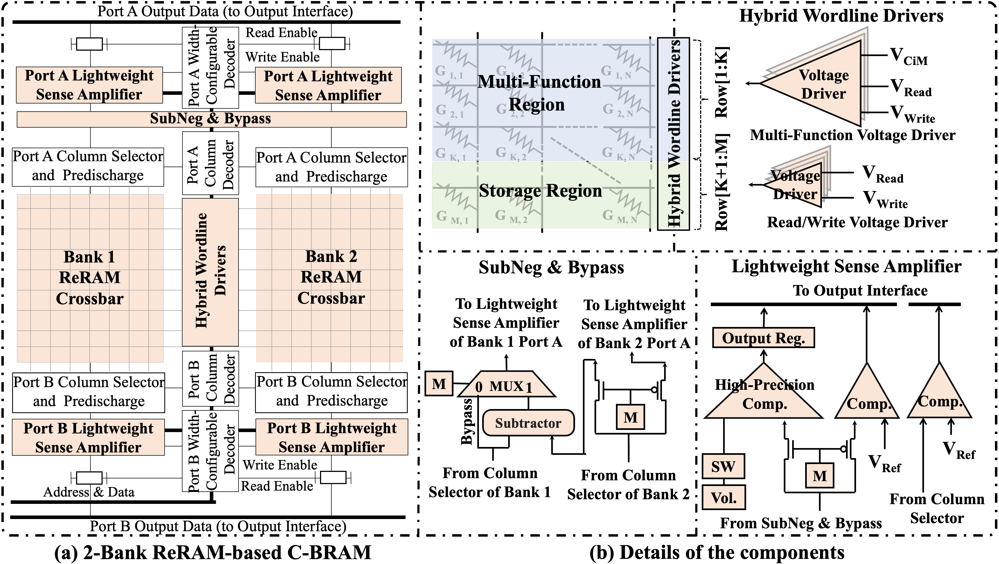
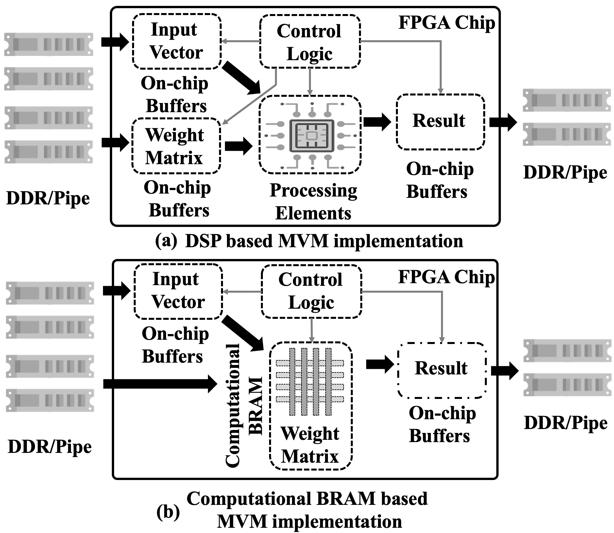

<!--
 * @Author: Hao Zhang haozhang@mail.sdu.edu.cn
 * @Date: 2022-08-13 15:33:31
 * @LastEditors: Ethan haozhang@mail.sdu.edu.cn
 * @LastEditTime: 2024-04-03 23:37:19
 * @FilePath: /Smokescreen/README.md
 * @Description: 
 * 
 * Copyright (c) 2022 by Hao Zhang haozhang@mail.sdu.edu.cn, All Rights Reserved. 
-->
# Smokescreen
<div align="center">

</div>

# Towards High-throughput Neural Network Inference with Computational BRAM on Nonvolatile FPGAs

## Introduction

Field-programmable gate arrays (FPGAs) have been widely used in artificial intelligence applications. As the capacity requirements of both computation and memory resources continuously increase, emerging nonvolatile memory has been proposed to replace static random access memory (SRAM) in FPGAs to build nonvolatile FPGAs (NV-FPGAs), which have advantages of high density and near-zero leakage power. Features of emerging nonvolatile memory should be fully explored to improve performance, energy efficiency as well as lifetime of NV-FPGAs. In this paper, we study an intrinsic characteristic of emerging nonvolatile memory, i.e., computing-in-memory, in nonvolatile block random access memory (BRAM) of NV-FPGAs. Specifically, we present a computational BRAM architecture (C-BRAM), and propose a computational density aware operator allocation strategy to fully utilize C-BRAM.

<div align="center">

  <br>
  <p>Architecture of C-BRAM.</p>
</div>

We explore another feature of NVMs, i.e., computation-in-memory (CiM), to study the architecture design and synthesis flow optimization of NV-FPGAs. CiM is a new paradigm in which computation tasks are performed directly within the memory units, rather than transferring data between memory and processing units for computation. By mapping weight to the conductance of NVM cells and vectors on the input voltage, the NVM crossbar can perform matrix-vector-multiplication (MVM) operations  with high parallelism. This enables NVM to work in computation mode in addition to traditional storage mode.

<div align="center">

  <br>
  <p>Offload some MVM OPs into C-BRAM.</p>
</div>


Specifically, we consider BRAMs in NV-FPGAs, which are essentially nonvolatile memory arrays distributed across NV-FPGA platforms. In addition to traditional storage function, we introduce computational function into BRAMs, referred to as computational BRAM (C-BRAM), and give architecture design as well as an operator allocation strategy to fully utilize high computing parallelism of C-BRAMs. 


To the best of our knowledge, this is the first work to study computational BRAM in the context of NV-FPGAs. We make the following contributions in this paper. 

- We explore how to adapt NVM-based CiM architecture into BRAM in NV-FPGA to reduce area overhead of peripheral circuits.
- We develop a computational density aware operator allocation strategy to select appropriate resource type for operators, leveraging the high computational density of C-BRAM to its full potential.
- We integrate the proposed architecture and strategy into an open-source FPGA synthesis tool-chain for evaluation.


## Implementation

### 0. Files structure

```
├── Flow                                                                        # Main work space
│   ├── Arch                                                                    # FPGA Architecture files
|   │   ├── k6FracN10LB_mem20K_complexDSP_customSB_22nm_nvm.dsp_heavy.xml       # Architecture file: NVBRAM with heavy DSP 
│   │   ├── k6FracN10LB_mem20K_complexDSP_customSB_22nm_cbram.dsp_heavy.xml     # Architecture file: BRAM-PIM with heavy DSP 
│   │   ├── k6FracN10LB_mem20K_complexDSP_customSB_22nm_sram.dsp_heavy.xml      # Architecture file: heavy DSP
│   ├── Circuits                                                                # Circuits files
│   ├── Output                                                                  # Output files
│   ├── Scripts                                                                 # Scripts files
├── Tool                                                                        # Some Tools
|   ├── COFFE                                                                   # COFFE framework used for estimate the performance and area of BRAM
│   ├── MNSIM-2.0                                                               # MNSIM simulator used for quantization simulation
│   ├── vtr-verilog-to-routing                                                  # FPGA synthesis tool
├── README.md
```

### 1. git clone some dependent submodules

```bash
git submodule init
git submodule update
```

or you can use `git clone --recursive` to clone the whole project.

### 2. build vtr with yosys

Yosys is a framework for Verilog RTL synthesis, used as one of three VTR front-ends to perform logic synthesis, elaboration, and converting a subset of the Verilog Hardware Description Language (HDL) into a BLIF netlist.
For more information, please refer to [vtr](https://docs.verilogtorouting.org/en/latest/yosys/).

Maybe you have to install some python packages, such as `prettytable`.

Before building vtr, you should install some packages.
please refer to [vtr](https://docs.verilogtorouting.org/en/latest/BUILDING/) and [yosys](https://docs.verilogtorouting.org/en/latest/yosys/quickstart/#building)

```bash
$VTR_ROOT/ make CMAKE_PARAMS="-DWITH_YOSYS=ON"
```

### 3. run vtr scripts

```bash
$VTR_ROOT/vtr_flow/scripts ./run_vtr_flow.py  Smokescreen_ROOT/Flow/Circuits/XXXX.v  Smokescreen_ROOT/Flow/Arch/XXXXX.xml  -temp_dir Smokescreen_ROOT/Flow/Output/XXXX -start yosys
```
If the scripts run successfully, you will get a `vpr.out` file in `Smokescreen_ROOT/Flow/Output/XXXX`. You can use `cat vpr.out` to check the result.
